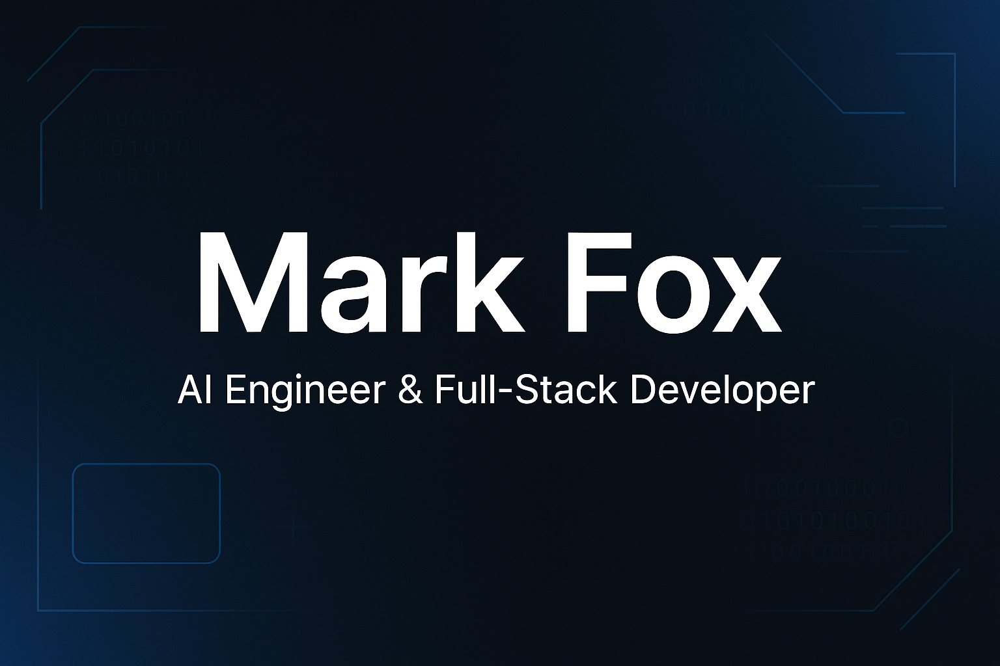

# 💼 Mark Fox - Developer Portfolio

**Live Site:** [https://markfox.dev](https://markfox.dev)

This is the personal portfolio of Mark Fox, an AI-focused full-stack developer passionate about building intelligent, user-centered tools. The site showcases a range of projects involving React, Python, Flask, and Hugging Face, with a clean, responsive, and modern design.

---

## 🚀 Features

- 🌙 **Dark Mode Toggle** with persistence
- 🧭 **Sticky Navbar** with smooth scroll and active section highlighting
- 🎨 **Responsive Design** built with Tailwind CSS + React
- 🎯 **Project Filtering** by tags
- 💬 **Contact Form** using Formspree
- 📎 **Resume Download** with analytics tracking
- 📊 **Google Analytics 4** integration
- 📸 **Social Sharing Preview** with Open Graph and Twitter meta tags
- 🖼️ **Custom Favicon & Banner Preview Image**
- ♿ **Accessibility Improvements**

---

## 📁 Tech Stack

- **Frontend:** React, Tailwind CSS, Vite
- **Backend (Project Demo):** Flask, Hugging Face Transformers
- **Tools:** AOS for animations, Formspree, Google Analytics, GitHub Pages/Vercel

---

## 📷 Preview



---

## 🛠 Local Development

To run locally:

```bash
git clone https://github.com/mark-fox/portfolio-site.git
cd portfolio-site
npm install
npm run dev
```

## 📄 Resume

You can [view the resume](https://markfox.dev/resume.pdf) or download it directly from the site via the **Resume** button in the navigation bar.

## 🤝 Contact

Interested in collaborating, hiring, or just saying hello?

Feel free to reach out through the [contact form](https://markfox.dev/#contact) on the site. I’ll get back to you as soon as possible.

## 📝 License

This project is open source and available under the [MIT License](LICENSE).
